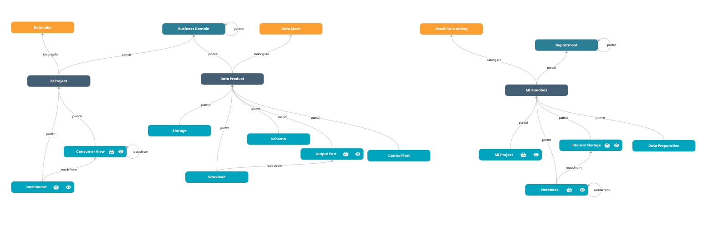

    

Designed by [Agile Lab](https://www.agilelab.it/), Witboost is a versatile platform that addresses a wide range of sophisticated data engineering challenges. It enables businesses to discover, enhance, and productize their data, fostering the creation of automated data platforms that adhere to the highest standards of data governance. Want to know more about witboost? Check it out [here](https://witboost.com/platform) or [contact us!](https://witboost.com/contact-us)

This repository is part of our [Starter Kit](https://github.com/agile-lab-dev/witboost-starter-kit) meant to showcase witboost's integration capabilities and provide a "batteries-included" product.

# Practice Shaper Presets

- [Overview](#overview)
- [Property Graph](#property-graph)
- [Presets](#presets)

## Overview

The **Practice Shaper** is the main and most impactful witboost setting that models witboost entities (domains, systems, components, templates) as nodes of a fully-configurable **property graph**.

This enables data-oriented organizations to shape witboost based on their unique use cases, structure, and needs.

Thanks to the Practice Shaper, a company can approach any project scenario in data (**Data Landscape**), such as Data Mesh, Business Intelligence, Machine Learning and others, by defining which practices are enabled and regulated, with the possibility to define technological and methodological guardrails.

Refer to the [witboost documentation](https://docs.witboost.agilelab.it) to learn more about Practice Shaper and Data Landscapes.

## Property Graph

The Practice Shaper property graph is composed of:

- **type nodes** - vertices representing abstract concepts (classes)
- **instance nodes** - concrete entities each instantiating one of the available type nodes
- **relations** - they are used to define relationships between nodes. For example, an instance node will always express an `instanceOf` relation towards a type node

Type nodes and the relations among them are defined by the Platform Team when configuring a Data Landscape.

Instance nodes and their relationships with type nodes (and other instance nodes) are generated by end users as they interact with the platform, within the context of a data landscape.

Both type and instance nodes are registered as witboost entities: their definition is provided by a catalog info YAML file (hosted in a Git repository), and they are part of the **witboost catalog**.

A sample Practice Shaper graph composed of data landscapes, domain types, system types, and component types, with their relationships:

## Presets

| Data Landscape        | Description                                                                                                                                                                                                                                                                                                                           | Installation guide                                                       |
| --------------------- | ------------------------------------------------------------------------------------------------------------------------------------------------------------------------------------------------------------------------------------------------------------------------------------------------------------------------------------- | ------------------------------------------------------------------------ |
| Data Mesh             | The Data Mesh is a decentralized approach to data architecture that emphasizes domain-oriented ownership, self-serve data infrastructure, and treating data as a product. It shifts the responsibility for data management and governance from a centralized data team to the various business domains that generate and use the data | [Go to the guide](./src/data-landscapes/data-mesh/README.md)             |
| Machine Learning      | Ecosystem of data that supports the development, training, and deployment of machine learning models                                                                                                                                                                                                                                  | [Go to the guide](./src/data-landscapes/machine-learning/README.md)      |
| Business Intelligence | Ecosystem of data and tools used to analyze and visualize business data to support decision-making                                                                                                                                                                                                                                    | [Go to the guide](./src/data-landscapes/business-intelligence/README.md) |

## License

This project is available under the [Apache License, Version 2.0](https://opensource.org/licenses/Apache-2.0); see [LICENSE](LICENSE) for full details.

## About us

 

    

 

Agile Lab creates value for its Clients in data-intensive environments through customizable solutions to establish performance driven processes, sustainable architectures, and automated platforms driven by data governance best practices.

Since 2014 we have implemented 100+ successful Elite Data Engineering initiatives and used that experience to create Witboost: a technology-agnostic, modular platform, that empowers modern enterprises to discover, elevate and productize their data both in traditional environments and on fully compliant Data mesh architectures.

[Contact us](https://www.agilelab.it/contacts) or follow us on:

- [LinkedIn](https://www.linkedin.com/company/agile-lab/)
- [Instagram](https://www.instagram.com/agilelab_official/)
- [YouTube](https://www.youtube.com/channel/UCTWdhr7_4JmZIpZFhMdLzAA)
- [Twitter](https://twitter.com/agile__lab)
